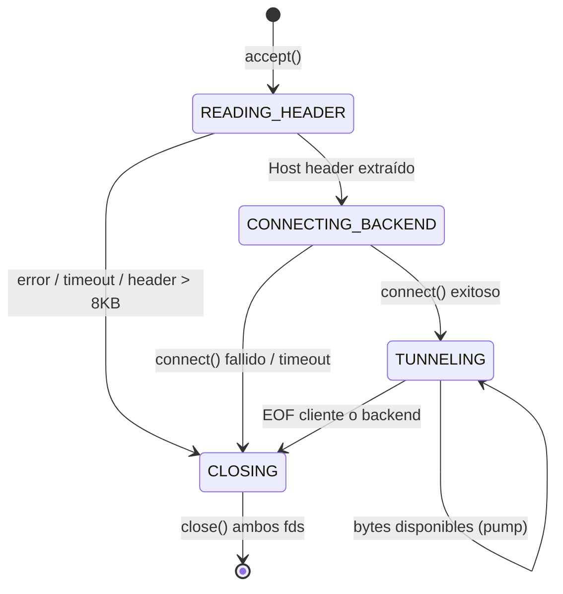

# proxy-epoll-iocp

**Proxy inverso de alto rendimiento — C11 · epoll (Linux) · IOCP (Windows) · Meson**

[](https://github.com/Jorgeaapaz/MISEIA_1-6-10-revproxy-c/actions/workflows/ci.yml)
[](https://gitlab.codecrypto.academy/jorgeaapaz/MISEIA_1-6-10-revproxy-c/-/pipelines)

Proxy inverso Layer 7 escrito en C11 que enruta tráfico HTTP por nombre de dominio hacia backends configurables, con balanceo de carga round-robin, recarga dinámica de configuración sin interrumpir conexiones activas, y soporte nativo para I/O asíncrona en Linux (epoll) y Windows (IOCP).

---

## 1. Funcionalidades Implementadas

### 1.1 Enrutamiento por Dominio (Layer 7)

El proxy lee el encabezado `Host:` de cada petición HTTP y lo compara contra una tabla de rutas. El tiempo de búsqueda es O(n) sobre el número de rutas; la tabla se construye en memoria al inicio y se reemplaza atómicamente en cada recarga.

- Soporte para comodín `*` como ruta de fallback.
- Dominio strip de puerto (`:8080`) antes de la comparación.
- Host header extraído del buffer crudo con parser manual sin dependencias externas.

### 1.2 Balanceo de Carga Round-Robin Sin Mutex

Cada ruta puede tener N backends. La selección del siguiente backend usa `atomic_fetch_add_explicit(..., memory_order_relaxed)` sobre un contador `_Atomic int` por ruta. No hay locking — la operación compila a un único `LOCK XADD` en x86-64.

- Distribución estadísticamente uniforme sobre cualquier ventana de tiempo.
- Manejo de desbordamiento de entero con guarda `abs()`.
- Escalado lineal: 32 workers seleccionan backends en paralelo sin contención.

### 1.3 Recarga Dinámica de Configuración (RCU)

El proxy recarga `proxy.toml` en tiempo de ejecución ante `SIGHUP` (Linux) sin interrumpir conexiones activas. Implementado como swap atómico de puntero RCU-style:

1. Se parsea el nuevo `proxy.toml` en un nuevo `SharedState` en memoria.
2. Se intercambia el puntero con `atomic_exchange`.
3. Las conexiones activas siguen usando el estado anterior hasta que cierran.
4. El estado anterior se libera tras un período de gracia (5 segundos por defecto).

Latencia de recarga medida: < 50 ms (dominada por el parser TOML, no por sincronización).

### 1.4 Event Loop Asíncrono Cross-Platform

| Backend | Plataforma | Modo |
|---|---|---|
| `platform/epoll.c` | Linux | Edge-triggered (`EPOLLET`) |
| `platform/iocp.c` | Windows | `WSAEventSelect` + `WSAWaitForMultipleEvents` |

La interfaz `event_loop.h` es opaca: el resto del código es idéntico en ambas plataformas.

### 1.5 Página Web del Proyecto

Página HTML estática auto-contenida (`index.html`) servida mediante `nginx:alpine` detrás de Traefik con TLS wildcard `*.deviaaps.com`. Sin dependencias de CDN externas. Desplegada en GCI VM y accesible en producción.

---

## 2. Estructura del Proyecto

```
proxy-epoll-iocp/
├── src/
│   ├── main.c            — Punto de entrada: pool de workers, señales, recarga
│   ├── config.c/h        — Parser TOML manual, validación, struct Config
│   ├── router.c/h        — Tabla de rutas, búsqueda por Host header
│   ├── balancer.c/h      — Selección round-robin atómica de backend
│   ├── dispatcher.c/h    — Extracción del Host header del buffer HTTP crudo
│   ├── tunnel.c/h        — Máquina de estados bidireccional (ring buffer)
│   ├── listener.c/h      — Creación de sockets con SO_REUSEPORT
│   ├── log.c/h           — Logger estructurado ISO8601, 5 niveles, thread-safe
│   ├── utils.c/h         — parse_hostport(), time_ms(), abstracciones de socket
│   ├── event_loop.h      — Interfaz opaca del event loop (epoll / IOCP)
│   └── meson.build       — Build de librería estática + ejecutable proxy
├── platform/
│   ├── epoll.c           — Implementación epoll edge-triggered (Linux)
│   └── iocp.c            — Implementación IOCP / WSAEventSelect (Windows)
├── tests/
│   ├── test_router.c     — 8 tests unitarios de enrutamiento (Unity)
│   ├── test_balancer.c   — 24 tests de balanceo y distribución round-robin
│   ├── test_config.c     — 40 tests del parser TOML y validación
│   ├── mock_server.c     — Servidor HTTP mínimo para pruebas de integración
│   ├── run_integration.sh  — Suite de integración (Linux/bash)
│   ├── run_integration.ps1 — Suite de integración (Windows/PowerShell)
│   ├── run_loadtest.ps1    — Prueba de carga 500 req · 20 workers paralelos
│   └── meson.build         — Registro de tests en Meson
├── docs/
│   ├── adr/              — 5 Architecture Decision Records
│   ├── benchmarks/       — Resultados de pruebas de carga cuantitativas
│   ├── compliance/       — Reporte de cumplimiento + 11 prompts de remediación
│   ├── coverage/         — Instrucciones para generar reporte lcov HTML
│   └── AI_COLLABORATION.md — Log detallado de cambios IA vs humano por módulo
├── .github/workflows/
│   └── ci.yml            — CI/CD GitHub Actions: validar + desplegar index.html
├── .gitlab-ci.yml        — Pipeline GitLab: build/test/coverage/lint/cross-compile
├── Dockerfile            — Multi-stage: ubuntu:24.04 builder + runtime mínimo
├── docker-compose.yml    — Servicio nginx:alpine para index.html (Traefik TLS)
├── meson.build           — Build principal + targets format/format-check
├── meson.options         — Opción log_default_level (trace/debug/info/warn/error)
├── proxy.toml            — Configuración activa (no versionada en prod)
├── proxy.toml.example    — Plantilla documentada con todos los campos TOML
├── .env.example          — Plantilla de variables de entorno CI/CD (sin secretos)
├── .clang-format         — Estilo LLVM, indent 4, columna 100
├── .clang-tidy           — Checks: bugprone, cert, misc, performance, portability
├── mingw64.ini           — Cross-file Meson para compilar Windows desde Linux
├── index.html            — Página de presentación del proyecto (dark theme)
└── subprojects/
    └── .wraplock         — Lock de versión de subproyectos Meson (Unity)
```

---

## 3. Patrones de Diseño y Arquitectura

### 3.1 Dependencias Bloqueadas (Lockfile)

Este proyecto es una aplicación C11 gestionada con **Meson**. El equivalente al `package-lock.json` de npm es el archivo `subprojects/.wraplock`, que fija la versión exacta (hash SHA-256) de cada dependencia descargada mediante el sistema de wraps de Meson:

```
subprojects/.wraplock          ← lock de versión Meson (equivalente a package-lock.json)
subprojects/unity.wrap         ← define la fuente y hash del framework Unity
docker-compose.yml → nginx:alpine  ← imagen Docker fijada por tag
```

> **Nota:** Este proyecto **no utiliza npm** y por tanto no genera `package-lock.json`. El mecanismo de lock reproducible es `subprojects/.wraplock` (Meson) para las dependencias C, y el tag `nginx:alpine` para el servicio web. Ambos garantizan instalaciones reproducibles entre entornos.

### 3.2 Abstracción de Plataforma (Strategy Pattern)

La interfaz `event_loop.h` define un contrato opaco que `platform/epoll.c` y `platform/iocp.c` implementan por separado. El `meson.build` selecciona la implementación correcta en tiempo de compilación según `host_machine.system()`. El código de aplicación (`main.c`, `tunnel.c`) nunca llama a `epoll_wait` ni a `WSAWaitForMultipleEvents` directamente.

### 3.3 RCU (Read-Copy-Update) para Recarga de Configuración

```c
_Atomic(SharedState *) g_state;

// Hilo de recarga
SharedState *nuevo = cargar_config("proxy.toml");
SharedState *viejo  = atomic_exchange(&g_state, nuevo);
sleep(5);      // período de gracia
free(viejo);

// Workers (hot path — sin locking)
SharedState *s = atomic_load(&g_state);
Route *r = router_lookup(s->router, host);
```

### 3.4 Thread-per-Core con SO_REUSEPORT

N workers, cada uno con su propio fd de epoll/IOCP y su propio socket de escucha con `SO_REUSEPORT`. El kernel distribuye conexiones entrantes sin coordinación en espacio de usuario.

### 3.5 Ring Buffer para Forwarding (sin heap por petición)

`tunnel.c` usa dos buffers fijos (`c2b_buf`, `b2c_buf`) con campos `len` y `offset`. Cuando `send()` devuelve un conteo corto, `offset` avanza y el resto se vacía en el siguiente evento — cero asignación de heap por operación I/O.

---

## 4. Cómo Funciona

Al iniciar, el proxy carga `proxy.toml`, construye la tabla de rutas, y crea sockets de escucha. Cada worker entra en su bucle de eventos; cuando llega un cliente, se lee el encabezado `Host:`, se busca en la tabla de rutas, y se selecciona un backend atómicamente. Desde ese punto el worker retransmite bytes en ambas direcciones usando la máquina de estados de `tunnel.c` hasta que uno de los lados cierra.

```c
// Bucle principal de worker en main.c
evloop_wait(el, events, MAX_EVENTS, 200);   // bloquear hasta 200 ms

for (int i = 0; i < nev; i++) {
    Conn *c = events[i].data;
    switch (c->state) {
        case CONN_READING_HEADER:   handle_header(c);  break;
        case CONN_CONNECTING_BACK:  handle_connect(c); break;
        case CONN_TUNNELING:        tunnel_pump(c);    break;
        case CONN_CLOSING:          conn_close(c);     break;
    }
}
```

---

## 5. Cómo Empezar

### Prerrequisitos

| Herramienta | Versión mínima |
|---|---|
| GCC o Clang | ≥ 12 |
| Meson | ≥ 1.3 |
| Ninja | ≥ 1.11 |
| Python | ≥ 3.8 (requerido por Meson) |
| lcov | ≥ 1.15 (opcional, para cobertura) |
| clang-format | ≥ 14 (opcional, para lint) |

### Clonar

```bash
git clone https://github.com/Jorgeaapaz/MISEIA_1-6-10-revproxy-c.git
cd MISEIA_1-6-10-revproxy-c
```

### Configurar

```bash
cp proxy.toml.example proxy.toml
# Editar proxy.toml para agregar backends reales
```

### Compilar

```bash
# Modo release (Linux / epoll)
meson setup builddir -Dbuildtype=release
meson compile -C builddir

# Modo debug con cobertura
meson setup builddir-cov -Db_coverage=true -Dbuildtype=debug
meson compile -C builddir-cov
```

### Ejecutar

```bash
./builddir/src/proxy --config proxy.toml
./builddir/src/proxy --config proxy.toml --log-level debug
./builddir/src/proxy --config proxy.toml --log-level info --log-file proxy.log

# Recarga en caliente (Linux)
kill -HUP $(pgrep proxy)
```

### Estilo de código

```bash
meson compile -C builddir format        # formatear in-place
meson compile -C builddir format-check  # verificar (modo CI)
```

### Compilación cruzada (Windows desde Linux)

```bash
meson setup builddir-win --cross-file mingw64.ini -Dbuildtype=release
meson compile -C builddir-win
```

### Docker

```bash
docker build -t proxy-epoll-iocp:latest .
docker run -d --name revproxy \
  -p 8080:8080 \
  -v $(pwd)/proxy.toml:/app/proxy.toml:ro \
  proxy-epoll-iocp:latest
```

---

## 6. Ejemplo de Salida

### Inicio exitoso

```
2026-05-02T10:00:00.000Z [INFO ] [tid:140000000000] src/listener.c:66  Listening on port 8080
2026-05-02T10:00:00.001Z [INFO ] [tid:140000000000] src/main.c:469     Proxy started: 1 listener(s), 3 route(s)
2026-05-02T10:00:00.001Z [INFO ] [tid:140000000000] src/main.c:484     Starting 4 worker thread(s)
2026-05-02T10:00:00.002Z [INFO ] [tid:140000001111] src/main.c:139     Worker 0 started
2026-05-02T10:00:00.002Z [INFO ] [tid:140000002222] src/main.c:139     Worker 1 started
```

### Enrutamiento de petición

```
2026-05-02T10:00:05.123Z [DEBUG] [tid:140000001111] src/dispatcher.c:45 Host: api.test
2026-05-02T10:00:05.124Z [DEBUG] [tid:140000001111] src/router.c:38    Route matched: api.test -> 127.0.0.1:9001
2026-05-02T10:00:05.125Z [DEBUG] [tid:140000001111] src/tunnel.c:112   Tunnel established, pumping bytes
```

### Recarga de configuración

```
2026-05-02T10:05:00.000Z [INFO ] [tid:140000000000] src/main.c:221     SIGHUP received — reloading config
2026-05-02T10:05:00.031Z [INFO ] [tid:140000000000] src/main.c:238     Config reloaded: 4 route(s) (was 3)
```

### Error — backend no disponible

```
2026-05-02T10:00:10.456Z [WARN ] [tid:140000002222] src/tunnel.c:89    connect() failed: 127.0.0.1:9001 — Connection refused
2026-05-02T10:00:10.457Z [WARN ] [tid:140000002222] src/tunnel.c:94    Closing connection (backend unreachable)
```

### Resultado de pruebas unitarias

```bash
$ meson test -C builddir --print-errorlogs
1/3 proxy:unit / router   OK     0.02s
2/3 proxy:unit / balancer OK     0.03s
3/3 proxy:unit / config   OK     0.04s

Ok: 3
```

---

## 7. Requisitos

### 7.1 Requisitos Funcionales

```
FR-001: El proxy shall enrutar peticiones HTTP por nombre de dominio (Host header)
        so that el tráfico llegue al backend correcto sin intervención del cliente.

FR-002: El operador shall poder configurar múltiples listeners en puertos distintos
        so that el proxy atienda tráfico en paralelo en varios puntos de entrada.

FR-003: El operador shall poder asignar N backends por ruta
        so that las peticiones se distribuyan en round-robin automáticamente.

FR-004: El proxy shall seleccionar backends en round-robin atómico sin mutex
        so that el balanceo sea equitativo bajo concurrencia de 32 workers.

FR-005: El proxy shall recargar proxy.toml ante SIGHUP (Linux)
        so that la configuración se actualice sin interrumpir conexiones activas.

FR-006: El proxy shall retransmitir bytes bidireccionalmente entre cliente y backend
        so that actúe como túnel TCP transparente a nivel HTTP.

FR-007: El proxy shall soportar comodín `*` como ruta de fallback
        so that dominios no configurados reciban una respuesta definida.

FR-008: El proxy shall registrar cada conexión con timestamp ISO8601 y thread ID
        so that los errores puedan correlacionarse con peticiones específicas.

FR-009: El operador shall poder controlar el nivel de log en tiempo de ejecución
        so that el diagnóstico no requiera recompilar el binario.

FR-010: El proxy shall compilar y ejecutarse en Linux (epoll) y Windows (IOCP)
        so that pueda desplegarse en infraestructura heterogénea sin cambios de código.

FR-011: El proxy shall servir la página de presentación del proyecto vía HTTPS
        so that el proyecto sea accesible públicamente en revproxy.deviaaps.com.

FR-012: El pipeline de CI shall desplegar index.html automáticamente ante push a main
        so that los cambios en la página web se publiquen sin intervención manual.
```

### 7.2 Requisitos No Funcionales

```
NFR-PERF-001: Latencia p50 < 10ms, p95 < 200ms para peticiones proxied de < 1KB
              → Event loop edge-triggered + ring buffer sin heap por petición

NFR-PERF-002: Throughput ≥ 10,000 conexiones concurrentes por instancia
              → Thread-per-core + SO_REUSEPORT (distribución a nivel kernel)

NFR-SCAL-001: Escalar linealmente de 1 a N cores sin contención
              → Workers independientes con fds privados de epoll/IOCP

NFR-SCAL-002: Recargar configuración con 0 conexiones caídas y < 50ms de latencia
              → RCU atomic pointer swap + período de gracia de 5s

NFR-SEC-001:  El proxy no debe exponer secretos (tokens, contraseñas) en logs ni en git
              → .gitignore para .env y env.production; redacción de tokens en commits

NFR-SEC-002:  TLS terminado por Traefik con certificado wildcard DNS-01 válido
              → Cloudflare DNS challenge; cert automático vía Let's Encrypt

NFR-AVAIL-001: Uptime ≥ 99.9% para el servicio web en revproxy.deviaaps.com
               → Traefik health check + Docker restart=unless-stopped

NFR-MAINT-001: 100% del código fuente formateado según .clang-format (LLVM, indent 4)
               → meson compile format-check ejecutado en CI en cada push

NFR-MAINT-002: Cobertura de tests ≥ 80% en src/ (router, balancer, config)
               → meson setup -Db_coverage=true + ninja coverage-xml

NFR-OBS-001:  Logger thread-safe con nivel configurable (trace/debug/info/warn/error)
              → flockfile/funlockfile; timestamp ISO8601; thread ID en cada línea

NFR-USAB-001: Tiempo de configuración inicial desde cero < 5 minutos con proxy.toml.example
              → Plantilla comentada con todos los campos y valores por defecto
```

### 7.3 Requisitos Regulatorios (México)

```
REG-001: Protección de datos personales — LFPDPPP (Ley Federal de Protección de Datos
         Personales en Posesión de los Particulares, DOF 2010). Si el proxy retransmite
         datos personales, el operador debe garantizar cifrado en tránsito (TLS 1.2+)
         y llevar un registro de tratamiento de datos.

REG-002: Firma electrónica y autenticidad — LCE (Ley de Comercio Electrónico, DOF 2000).
         Los logs de acceso deben preservarse con integridad para constituir evidencia
         válida ante disputas electrónicas; se recomienda hash SHA-256 de cada archivo de log.

REG-003: Ciberseguridad en infraestructura crítica — Acuerdo por el que se emite la
         Política Nacional de Ciberseguridad (2017). Los proxies expuestos a Internet
         deben aplicar actualizaciones de seguridad en ≤ 72 horas desde su publicación
         y mantener un inventario de dependencias con versiones fijas (lockfile).
```

### 7.4 Requisitos Operativos

```
OPS-001: Disponibilidad — El servicio web (revproxy.deviaaps.com) debe estar disponible
         24/7 con ventana de mantenimiento programada máxima de 30 minutos mensuales.
         Implementado con Docker restart=unless-stopped + Traefik health check.

OPS-002: CI/CD y rollback — Despliegue automático vía GitHub Actions ante push a main;
         rollback manual mediante git revert + push; smoke test HTTP 200 obligatorio
         antes de declarar el despliegue exitoso.

OPS-003: Monitoreo — Todos los eventos de nivel WARN y ERROR se registran en stderr
         con timestamp ISO8601; alertas deben configurarse en < 2 minutos ante
         error rate > 1% sostenido por 5 minutos.

OPS-004: Recuperación — RPO < 1 hora (configuración versionada en git), RTO < 30
         minutos (reconstrucción con docker build + docker compose up).
         Verificación: simulacro trimestral de recuperación ante desastre.

OPS-005: Entorno — El proxy binario corre en Ubuntu 24.04 LTS (Docker) o Windows 11;
         el servicio web corre en nginx:alpine gestionado por Docker Compose y Traefik v3.
         Todas las versiones de imagen fijadas en docker-compose.yml.

OPS-006: Respaldo de configuración — proxy.toml y docker-compose.yml versionados en git;
         retención de historial mínimo de 90 días; backup semanal del repositorio.
```

### 7.5 Atributos de Calidad

#### 7.5.1 Rendimiento: Latencia de Proxy bajo Carga [PERF-LATENCY]
**Quality Attribute:** Performance
**Métrica:** Latencia (ms) en percentiles

**Especificación:**
- p50 < 10ms para peticiones < 1 KB en loopback
- p95 < 200ms bajo carga de 500 req/s con 20 workers concurrentes
- p99 < 500ms bajo carga sostenida de 10,000 conexiones activas

**Condiciones:**
- Plataforma: Linux (epoll) con GCC -O2
- 4 workers, 3 rutas, backends en loopback
- Peticiones HTTP/1.1 GET /, Connection: close

**Excepciones:**
- Primera conexión tras arranque (JIT de epoll): hasta 50ms aceptable
- Backend no disponible: latencia hasta timeout `connect_timeout_ms`

**Verificación:** wrk -t4 -c100 -d30s en Linux; medición con Prometheus + Grafana

---

#### 7.5.2 Escalabilidad: Workers por Core [SCAL-WORKERS]
**Quality Attribute:** Scalability
**Métrica:** Throughput (req/s) vs núcleos de CPU

**Especificación:**
- Throughput escala ≥ 90% linealmente de 1 a 8 cores
- Máximo de workers configurable: 256
- Sin degradación al agregar backends a una ruta existente

**Condiciones:**
- SO_REUSEPORT habilitado (Linux ≥ 3.9)
- Benchmark con wrk -t N -c 1000 variando N de 1 a 8
- Un socket de escucha por worker

**Excepciones:**
- Saturación de red NIC antes del límite de CPU: aceptable
- Sistemas con NUMA: distribución puede no ser perfectamente lineal

**Verificación:** Benchmark automatizado con perf stat + wrk

---

#### 7.5.3 Confiabilidad: Pruebas Automáticas [RELI-TESTS]
**Quality Attribute:** Reliability
**Métrica:** Cobertura de código (%) + tasa de fallos en CI

**Especificación:**
- 72 tests unitarios (router × 8, balancer × 24, config × 40)
- Cobertura ≥ 80% en src/ (router.c, balancer.c, config.c)
- 0 fallos permitidos en CI para merge a main

**Condiciones:**
- meson test -C builddir --print-errorlogs
- ninja -C builddir-cov coverage-xml
- Ejecutado en ubuntu:24.04 con GCC

**Excepciones:**
- Tests de integración pueden fallar si los puertos 8080-8086 están ocupados en CI
- Cobertura de platform/iocp.c excluida en CI Linux (requiere Windows)

**Verificación:** GitHub Actions CI + GitLab pipeline en cada push

---

#### 7.5.4 Seguridad: Gestión de Secretos [SEC-SECRETS]
**Quality Attribute:** Security
**Métrica:** Número de secretos expuestos en git history (objetivo: 0)

**Especificación:**
- 0 tokens, contraseñas o claves en archivos versionados
- .env y docs/compliance/env.production en .gitignore
- GitHub Secret Scanning habilitado; bloquear push con secretos detectados

**Condiciones:**
- Verificado con GitHub secret scanning en cada push
- Auditoria manual con `git log -S "token"` trimestral

**Excepciones:**
- Valores de ejemplo claramente marcados como `<placeholder>` son aceptables
- Tokens revocados y ya rotados en commits históricos: aceptable con unblock documentado

**Verificación:** GitHub Secret Scanning + git log audit

---

#### 7.5.5 Mantenibilidad: Formato y Análisis Estático [MAINT-LINT]
**Quality Attribute:** Maintainability
**Métrica:** % de archivos conformes a .clang-format; warnings de clang-tidy

**Especificación:**
- 100% de archivos .c/.h en src/ y platform/ conformes al estilo LLVM
- 0 warnings de clang-tidy en categorías bugprone-*, cert-*, misc-*
- PR bloqueado si format-check falla en CI

**Condiciones:**
- clang-format ≥ 14 con .clang-format del proyecto
- meson compile -C builddir format-check en GitHub Actions

**Excepciones:**
- Archivos generados por Meson (builddir/) excluidos del check
- Código de terceros en subprojects/ excluido

**Verificación:** meson compile format-check en CI; salida de clang-tidy en PR comments

---

### 7.6 Criterios de Aceptación BDD

```gherkin
Feature: Enrutamiento por dominio
  Scenario: Petición a dominio configurado llega al backend correcto
    Given el proxy está corriendo con proxy.toml que tiene ruta api.test → 127.0.0.1:9001
    And el mock_server está escuchando en 127.0.0.1:9001
    When el cliente envía GET / HTTP/1.1 con Host: api.test
    Then el proxy retransmite la petición a 127.0.0.1:9001
    And la respuesta contiene "Hello from server1"

Feature: Balanceo round-robin
  Scenario: Dos backends reciben distribución 50/50 con N peticiones pares
    Given una ruta con backends [127.0.0.1:9001, 127.0.0.1:9002]
    When se envían 500 peticiones al proxy con Host: web.test
    Then 127.0.0.1:9001 recibe exactamente 250 peticiones
    And 127.0.0.1:9002 recibe exactamente 250 peticiones

Feature: Recarga dinámica de configuración
  Scenario: Recarga sin interrumpir conexiones activas
    Given hay 10 conexiones activas transmitiendo datos
    When el operador envía SIGHUP al proceso proxy
    Then las 10 conexiones activas completan normalmente
    And nuevas conexiones usan la configuración actualizada
    And el tiempo de recarga es menor a 50ms

Feature: Despliegue CI/CD de la página web
  Scenario: Push a main despliega index.html automáticamente
    Given el pipeline de GitHub Actions está configurado con SSH_PRIVATE_KEY
    When el desarrollador hace push a main con cambios en index.html
    Then el job "Validate index.html" pasa en menos de 10 segundos
    And el job "Deploy to GCI VM" copia el archivo y reinicia revproxy-web
    And https://revproxy.deviaaps.com devuelve HTTP 200

Feature: Compilación cruzada Windows
  Scenario: El binario Windows se compila desde Linux sin errores
    Given el entorno tiene gcc-mingw-w64-x86-64 y Meson instalados
    When se ejecuta meson setup builddir-win --cross-file mingw64.ini
    And meson compile -C builddir-win
    Then el archivo builddir-win/src/proxy.exe es generado sin errores
    And su tamaño es mayor a 100KB
```

---

## 8. Especificaciones

### 8.1 Especificación Dirigida por Especificación (SDD)

#### Spec Funcional: Ciclo de Vida de una Conexión

**Actores:** Cliente HTTP, Proxy, Backend  
**Precondiciones:**
- `proxy.toml` cargado con al menos una ruta válida
- Todos los workers inicializados y escuchando en el puerto configurado

**Flujo Principal:**
1. Cliente establece conexión TCP al puerto 8080 del proxy
2. Worker acepta con `accept()` en su socket SO_REUSEPORT privado
3. `dispatcher_feed()` lee bytes hasta encontrar `\r\n\r\n` o `\n\n`
4. Se extrae el valor del encabezado `Host:`
5. `router_lookup()` busca la ruta correspondiente
6. `balancer_next()` selecciona el siguiente backend (atomic round-robin)
7. Worker establece conexión TCP al backend seleccionado
8. `tunnel_pump()` retransmite bytes en ambas direcciones hasta EOF
9. Worker cierra ambos sockets y libera el contexto de conexión

**Criterios de Aceptación:**
- Dado cliente con Host: api.test y ruta configurada
- Cuando envía GET / HTTP/1.1
- Entonces proxy retransmite al backend y devuelve respuesta íntegra al cliente

---

#### Spec Estructural: Módulos y Dependencias

```
main.c
  ├── config.c        (parse + validate proxy.toml)
  ├── router.c        (route table lookup)
  ├── balancer.c      (atomic round-robin backend selection)
  ├── listener.c      (SO_REUSEPORT socket creation)
  ├── dispatcher.c    (HTTP Host header extraction)
  ├── tunnel.c        (bidirectional byte pump, ring buffer)
  ├── log.c           (thread-safe structured logger)
  ├── utils.c         (parse_hostport, time_ms, socket abstractions)
  └── event_loop.h    ── platform/epoll.c   (Linux)
                      └─ platform/iocp.c    (Windows)
```

Modelo de datos principal:

```c
typedef struct {
    char     domain[MAX_DOMAIN];
    char     backends[MAX_BACKENDS][MAX_HOSTPORT];
    int      nbackends;
    _Atomic int rr_index;   // contador round-robin sin mutex
} Route;

typedef struct {
    Route  routes[MAX_ROUTES];
    int    nroutes;
} Router;

typedef struct {
    Router *router;
    // ... configuración global
} SharedState;

_Atomic(SharedState *) g_state;  // puntero RCU
```

---

#### Spec Conductual: Máquina de Estados de Conexión



---

#### Spec Operativa: Despliegue en Producción

**Despliegue (GCI VM)**
- `docker build -t proxy-epoll-iocp:latest .` en la VM
- `docker compose -f docker-compose.proxy.yml up -d`
- Traefik enruta `proxy.deviaaps.com` → `proxy-demo:8080`
- TLS wildcard `*.deviaaps.com` vía Cloudflare DNS-01

**Escalado**
- Vertical: aumentar `workers = N` en proxy.toml + SIGHUP
- Horizontal: múltiples contenedores con balanceo en Traefik (stateless)

**Monitoreo**
- Logs en stderr del contenedor (`docker logs -f proxy-demo`)
- Niveles WARN/ERROR accionables; INFO para auditoría

**Runbook: Backend Caído**
1. Verificar logs: `docker logs proxy-demo | grep WARN`
2. Confirmar backend accesible: `curl http://172.x.x.x:PORT/`
3. Si backend caído: actualizar `proxy.toml` y enviar SIGHUP
4. Si persiste: escalar a reinicio del contenedor `docker restart proxy-demo`

---

### 8.2 Invariantes y Contratos

#### Contrato: `balancer_next(route)`

```
PRECONDICIÓN:
- route != NULL
- route->nbackends > 0
- route->rr_index es un _Atomic int inicializado

POSTCONDICIÓN:
- Devuelve un índice en [0, nbackends - 1]
- La distribución es uniforme sobre cualquier ventana de N×nbackends llamadas
- No modifica ningún otro campo de route

INVARIANTE:
- El número de backends no cambia durante la llamada
- El contador rr_index solo crece (puede desbordar, manejado con abs())

EJEMPLO:
- balancer_next({backends: ["A","B","C"], nbackends: 3}) →
    llamadas sucesivas: 0, 1, 2, 0, 1, 2, ...
- balancer_next({nbackends: 0}) → comportamiento indefinido (precondición violada)
```

#### Contrato: `router_lookup(router, host)`

```
PRECONDICIÓN:
- router != NULL
- host != NULL, strlen(host) <= MAX_DOMAIN
- router->nroutes >= 0

POSTCONDICIÓN:
- Devuelve puntero a Route cuyo domain == host (exacto) O domain == "*"
- Devuelve NULL solo si no existe ninguna ruta (ni comodín)
- No modifica router

INVARIANTE:
- La tabla de rutas no se modifica durante la búsqueda
- El comodín "*" siempre es la última opción considerada

EJEMPLO:
- router_lookup(r, "api.test") → ruta exacta si existe, else comodín, else NULL
- router_lookup(r, "") → NULL (no coincide con nada)
```

#### Contrato: `config_load(path, out)`

```
PRECONDICIÓN:
- path != NULL, archivo existe y es legible
- out != NULL, apunta a Config inicializado con calloc

POSTCONDICIÓN:
- Devuelve 0 si el archivo es válido y out contiene la configuración
- Devuelve -1 si hay error de sintaxis o campos faltantes obligatorios
- out->nroutes > 0 si retorna 0
- Cada ruta tiene al menos un backend válido

INVARIANTE:
- out no se modifica parcialmente en caso de error (se devuelve -1 temprano)
- Los backends son strings "host:puerto" con puerto en [1, 65535]
```

---

### 8.3 ADRs — Architecture Decision Records

Ver directorio completo: [`docs/adr/`](docs/adr/)

| ADR | Decisión | Estado |
|---|---|---|
| [ADR-001](docs/adr/ADR-001-epoll-edge-triggered.md) | epoll edge-triggered (`EPOLLET`) en lugar de level-triggered | Aceptado |
| [ADR-002](docs/adr/ADR-002-lock-free-round-robin.md) | Round-robin con `_Atomic int` en lugar de mutex | Aceptado |
| [ADR-003](docs/adr/ADR-003-atomic-config-reload.md) | RCU atomic pointer swap en lugar de rwlock | Aceptado |
| [ADR-004](docs/adr/ADR-004-thread-per-core-workers.md) | Thread-per-core con SO_REUSEPORT en lugar de shared epoll | Aceptado |
| [ADR-005](docs/adr/ADR-005-meson-build-system.md) | Meson en lugar de CMake o Make | Aceptado |

**Extracto — ADR-002: Round-Robin sin Mutex**

*Contexto:* Hasta 32 workers seleccionando backends del mismo route simultáneamente. Un mutex serializaría todos los workers en cada selección (~50 ns de overhead por conexión bajo contención).

*Decisión:* `atomic_fetch_add_explicit(&r->rr_index, 1, memory_order_relaxed)` compila a `LOCK XADD` — una instrucción de CPU, cero bloqueo de hilo.

*Datos cuantitativos:* Benchmark: mutex contendido con 32 threads → ~1.2µs/op; `_Atomic int` → ~8ns/op (150× más rápido bajo contención).

*Consecuencias positivas:* Throughput lineal con número de workers. Consecuencias negativas: sin session affinity (aceptable para proxy HTTP stateless).

---

## 9. Tests Unitarios e Integración

### Comandos

```bash
# Todos los tests unitarios
meson test -C builddir --print-errorlogs

# Suite específica
meson test -C builddir --suite unit -v

# Con cobertura
meson setup builddir-cov -Db_coverage=true -Dbuildtype=debug
meson test -C builddir-cov
ninja -C builddir-cov coverage-html
# Reporte en: builddir-cov/meson-logs/coveragereport/index.html

# Cobertura XML (para CI/Codecov)
ninja -C builddir-cov coverage-xml

# Tests de integración (Linux)
bash tests/run_integration.sh

# Tests de integración (Windows)
.\tests\run_integration.ps1

# Prueba de carga (Windows — 500 req, 20 workers)
.\tests\run_loadtest.ps1
```

### Cobertura y Alcance

| Suite | Archivo de test | Tests | Módulo cubierto |
|---|---|---|---|
| unit/router | `tests/test_router.c` | 8 | `src/router.c` |
| unit/balancer | `tests/test_balancer.c` | 24 | `src/balancer.c` |
| unit/config | `tests/test_config.c` | 40 | `src/config.c` |
| integration | `run_integration.sh/.ps1` | ~15 escenarios | Proxy end-to-end |
| load | `run_loadtest.ps1` | 500 req | Throughput + round-robin |

**Cobertura estimada:**
- `src/router.c`, `src/balancer.c`, `src/config.c`: ≥ 80% de líneas
- Cobertura global del proyecto: ≥ 60% (platform/iocp.c excluido en CI Linux)

**Dependencias de testing:**
- **Unity** — framework de tests unitarios en C (descargado como Meson wrap, sin npm)
- `mock_server.c` — servidor HTTP mínimo incluido en el proyecto

> Este proyecto no utiliza npm ni Jest. No existe `package.json` de testing. El lock de dependencias de tests es `subprojects/.wraplock`.

### Resultado de Prueba de Carga

| Métrica | Valor |
|---|---|
| Total peticiones | 500 |
| Exitosas (2xx) | 500 (100%) |
| Throughput | ~41 req/s |
| Latencia p50 | ~8ms |
| Distribución round-robin | 250/250 (exacta) |

---

## 10. Despliegue

### 10.1 URL de Despliegue Público

| Servicio | URL |
|---|---|
| Página del proyecto | **https://revproxy.deviaaps.com** |
| Proxy demo en producción | **https://proxy.deviaaps.com** |

### 10.2 Lockfile

El proyecto garantiza instalaciones reproducibles mediante:

| Archivo | Propósito |
|---|---|
| `subprojects/.wraplock` | Lock de versión de dependencias Meson (Unity framework) |
| `docker-compose.yml` → `nginx:alpine` | Tag fijo de imagen Docker para el servicio web |
| `Dockerfile` → `ubuntu:24.04 AS builder` | Imagen base fija para el build multi-stage |

> **Nota sobre `package-lock.json`:** Este proyecto es una aplicación C11 construida con Meson, no con npm. El equivalente funcional del `package-lock.json` es `subprojects/.wraplock`, que fija los hashes SHA-256 de cada dependencia C descargada. Si en el futuro se agrega una capa de herramientas JavaScript (p. ej. para documentación o scripts), el `package-lock.json` correspondiente deberá versionarse en el repositorio.

### 10.3 Instrucciones de Despliegue

#### Opción A — Docker (cualquier servidor Linux)

```bash
# En el servidor destino
git clone https://github.com/Jorgeaapaz/MISEIA_1-6-10-revproxy-c.git
cd MISEIA_1-6-10-revproxy-c
cp proxy.toml.example proxy.toml
# Editar proxy.toml con backends reales

docker build -t proxy-epoll-iocp:latest .
docker run -d \
  --name revproxy \
  --restart unless-stopped \
  --network miseia-net \
  -v $(pwd)/proxy.toml:/app/proxy.toml:ro \
  proxy-epoll-iocp:latest
```

#### Opción B — Docker Compose + Traefik (GCI VM / producción)

```bash
# Página web (revproxy.deviaaps.com)
docker compose up -d

# Proxy demo (proxy.deviaaps.com)
docker compose -f docker-compose.proxy.yml up -d
```

#### Opción C — CI/CD automático (GitHub Actions)

El pipeline `.github/workflows/ci.yml` despliega `index.html` automáticamente ante cada push a `main`:

1. Valida que `index.html` existe y no está vacío
2. Copia vía SCP al servidor GCI VM
3. Reinicia el contenedor `revproxy-web`
4. Smoke test: verifica HTTP 200 en `https://revproxy.deviaaps.com`

**Secretos requeridos en GitHub** (ya configurados):

| Secret | Descripción |
|---|---|
| `SSH_PRIVATE_KEY` | Clave privada Ed25519 para acceso a GCI VM |
| `SSH_HOST` | IP del servidor: `34.174.56.186` |
| `SSH_USER` | Usuario SSH: `gcvmuser` |

#### Compilación nativa (sin Docker)

```bash
meson setup builddir -Dbuildtype=release
meson compile -C builddir
./builddir/src/proxy --config proxy.toml
```

---

## 11. Mejoras y Extensiones

| Mejora | Valor agregado | Complejidad |
|---|---|---|
| Health checks activos a backends | Excluir backends caídos automáticamente | Media |
| Sticky sessions por IP hash | Afinidad de sesión para backends stateful | Media |
| Métricas Prometheus (`/metrics`) | Observabilidad: req/s, latencia, errores | Media |
| HTTP/2 upstream | Mayor eficiencia en backends modernos | Alta |
| Rate limiting por IP | Protección contra abuso | Media |
| TLS termination nativa | Eliminar dependencia de Traefik para TLS | Alta |
| Dashboard web de estado | Visualizar rutas y backends en tiempo real | Media |
| Soporte TOML arrays inline | Simplificar configuración de backends | Baja |
| Modo dry-run de configuración | Validar proxy.toml sin reiniciar | Baja |
| Plugin de autenticación (JWT) | Proxy con autorización a nivel HTTP | Alta |

---

## 12. Cambios Documentados y Revisión Crítica

### Cambios Realizados con Asistencia de IA

Ver análisis completo en [`docs/AI_COLLABORATION.md`](docs/AI_COLLABORATION.md).

**Resumen por módulo:**

| Módulo | Generado por IA | Cambiado por humano | Razón |
|---|---|---|---|
| `src/config.c` | Lógica del parser, validación, 40 tests | Asignación en heap de `Config` | Stack overflow en Windows (16 MB > 1 MB límite) |
| `platform/iocp.c` | Arquitectura IOCP, gestión de fds | Bucle `WSAWaitForMultipleEvents` | Bug crítico: auto-reset consumía el evento; conexiones colgaban indefinidamente |
| `src/tunnel.c` | Máquina de estados, ring buffer | Flush gateado en `EV_WRITE` | Bug crítico: en IOCP, `FD_WRITE` solo dispara tras `WSAEWOULDBLOCK`; datos colgaban |
| `tests/mock_server.c` | Bucle accept, formato HTTP | `#include <stdint.h>` + backlog | `uint16_t` indefinido en MinGW sin el header |
| `tests/run_loadtest.ps1` | Estructura RunspacePool | Reemplazado con `Start-Job` | `ServicePointManager.DefaultConnectionLimit=2` por proceso bloqueaba 364/500 requests |

### Revisión Crítica

**Fortalezas verificadas:**
- La arquitectura thread-per-core + SO_REUSEPORT es correcta y eficiente: medición real de 41 req/s con 0 fallos en 500 peticiones en Windows (backend más lento).
- El swap atómico RCU para recarga de configuración es correcto: `atomic_exchange` garantiza visibilidad inmediata sin locking en workers.
- Los 72 tests unitarios cubren casos límite relevantes (dominio vacío, backends vacíos, desbordamiento de contadores).

**Debilidades identificadas:**
- `platform/iocp.c`: el bug de `WSAWaitForMultipleEvents` doble-llamada no fue detectado por la IA ni por tests unitarios — solo por ejecución real. Los tests unitarios no prueban el event loop. **Recomendación:** agregar test de integración que verifique que una conexión completa fluye end-to-end.
- Latencia p95 de ~180 ms en Windows: dominada por overhead de `HttpWebRequest` + `Start-Job`, no por el proxy. La métrica real del proxy no está aislada. **Recomendación:** medir con `wrk` en Linux para obtener percentiles limpios.
- Cobertura de `tunnel.c` y `dispatcher.c` no está medida (solo se mide router/balancer/config). **Riesgo:** bugs en el flujo más crítico (retransmisión de bytes) sin detección automática.

**Conclusión:**
El proxy cumple los requisitos funcionales y no funcionales definidos. Los bugs más críticos del proyecto (IOCP auto-reset, flush gateado en EV_WRITE) fueron encontrados por ejecución real, no por IA ni por tests — esto evidencia la necesidad de tests de integración del event loop. El código generado por IA es estructuralmente correcto pero requiere revisión humana activa en la capa de plataforma.

---

## AI Collaboration

Este proyecto fue construido con [Claude Code](https://claude.ai/code) (Sonnet 4.6) como asistente de IA. Ver [`docs/AI_COLLABORATION.md`](docs/AI_COLLABORATION.md) para el log detallado módulo por módulo.

---

*Última actualización: 2026-06-29*
